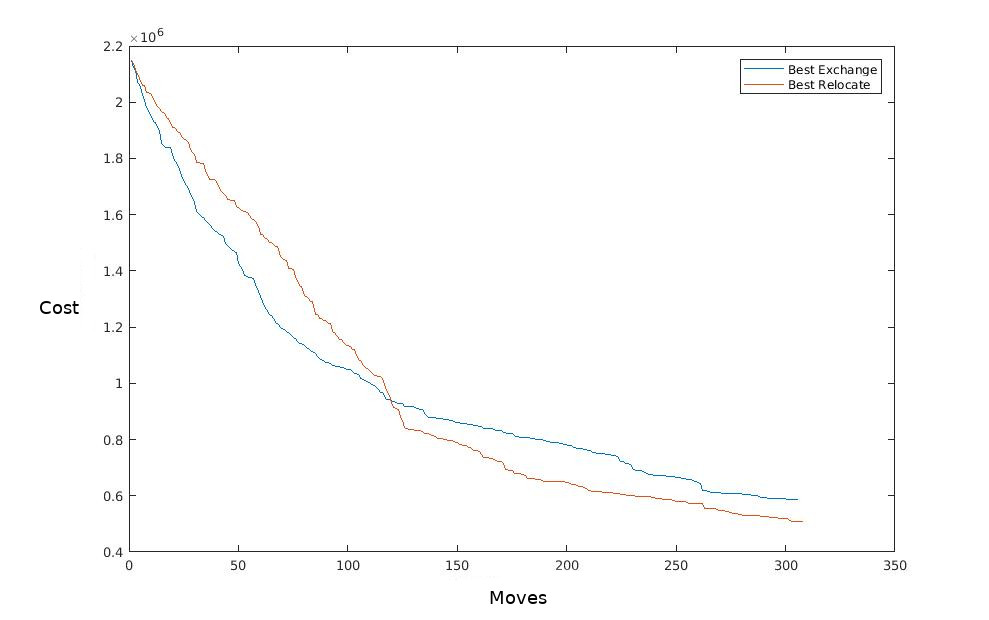
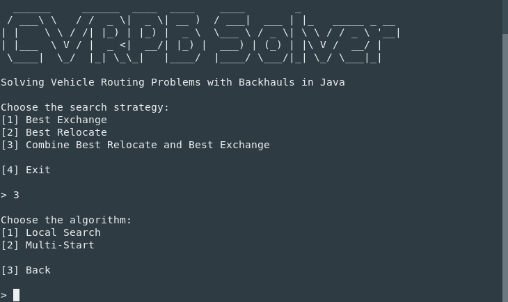

# VehicleRoutingProblems4J
## Solving Vehicle Routing Problems with Backhauls in Java

This project allows solving capacitated vehicle routing problems with backhauls (CVRPBs) with a heuristic approach.

Generally speaking, a *Vehicle Routing Problem* (VRP) is a combinatorial optimization and integer programming problem which asks to find an optimal set of routes for a fleet of vehicles that has to deliver to a given set of customers. Each route starts from the depot, then the corresponding vehicle has to deliver a certain amount of product to the visited customers.
The goal is to determine the optimal set of routes, namely a solution that minimizes the total cost, depending on a number of measures, like the total distance or the spent time.

Several specializations of the Vehicle Routing Problem exist, including the *Capacitated VRP*, that places an upper bound on the maximum capacity of each vehicle. Hence,  a route is regarded as illegal, if the total demand of the visited customers exceeds the capacity of the vehicles.

A *Capacitated Vehicle Routing Problem with Backhauls* (CVRPB) is a further extension of the *CVRP*, such that the set of the customers is partitioned into two subsets:

* the *Linehaul* customers, each requiring a given amount of product to be delivered;
* the *Backhaul* customers, where a given amount of inbound product must be picked up.

It has been widely recognized that, in this scenario, a significant saving in transportation costs can be achieved by visiting backhaul customers in distribution routes.

Hence, more precisely, a CVRPB asks to determine a set of vehicle routes visiting all customers, such that:

* each vehicle performs one route;
* each route starts and ends at the depot;
* for each route, the total load associated with linehaul and backhaul customers does not exceed, separately, the maximum capacity of the vehicles;
* for each route, the backhual customers, if any, are visited after all linehaul customers;
* each route contains at least a linehaul customer;
* the total cost of the routes is minimum.

## Approach
The *Vehicle Routing Problem* is classified as *NP-hard* and, subsequently, we apply a heuristic approach which acts in two steps:

* first, we generate an initial solution which fulfills all the constraints of the problem;
* next, we apply a local search to improve the initial solution and minimize the objective value.

The system provides several strategies to explore the search space for possible solutions:

* _Best Exchange_
* _Best Relocate_
* Combination of _Best Exchange_ and _Best Relocate_

The project implements both a *greedy* and a *multi-stage* approach.

Also, a multi-start meta-heuristic approach has been developed to further improve the performance of the system.


## API

VRP4J provides a flexible and easy-to-use API.

You can define several strategies to build an initial solution by implementing the ```it.unica.ro.cvrpb.solver.construction.ConstructionStrategy``` interface.
You can see some examples in the classes:
* ```BaseConstructionStrategy```
* ```ShuffleConstructionStretegy```
* ```RandomConstructionStrategy```

Also, VRP4J allows defining custom strategies to explore the search space. Simply implement the ```it.unica.ro.cvrpb.solver.localsearch.LocalSearchStrategy``` interface. Some examples are provided by the classes:
* ```BestImprovement```
* ```BestExchange```
* ```BestRelocate```
* ```BestRelocateExchange```

These strategies explore the search space by evaluating the application of several moves, then the move yielding the best improvement in the objective value is finalized. You can define custom moves by implementing the ```it.unica.ro.cvrpb.solver.moves.MoveOperator``` interface.
See
* ```ExchangeMove``` and
* ```RelocateMove```

for detailed examples.

Moreover, the project allows to easily implement a new approach to solve a CVRPB problem, by implementing the ```CVRPBSolver``` interface. For instance, check the following classes:
* ```CVRPBLocalSearchSolver```
* ```CVRPBMultiStartSolver```


#### Example

```java
// read the problem to be solved
String path = Settings.INSTANCES_PATH + "A1.txt";
CVRPBReader reader = new CVRPBReader();
CVRPBProblem problem = reader.read(path);

// Set the strategy used to construct the initial solution
ConstructionStrategy constructionStrategy = new BaseConstructionStrategy();

// Set the strategy applied to explore the search space
LocalSearchStrategy localSearchStrategy = new BestRelocateExchange();

// Set the heuristic algorithm
CVRPBSolver solver = new CVRPBLocalSearchSolver(
        constructionStrategy,
        localSearchStrategy
);

// Solve the problem
CVRPBSolution solution = solver.solve(problem);

System.out.println("Routes");
solution.stream().forEach(System.out::println);
System.out.println();
double cost = solution.getTotalCost();
System.out.println("Cost: " + cost);
```

## Results

#### Local Search + Best Relocate + Best Exchange

Instance|Number of Customers|Time|Total Cost|Lower Bound|GAP
-|-|-|-|-|-
A1.txt|25|0.02|233641|229886|0.016
B1.txt|30|0.003|265692|239080|0.111
C1.txt|40|0.003|310803|250556|0.24
D1.txt|38|0.004|335142|322530|0.039
E1.txt|45|0.005|282140|238880|0.181
F1.txt|60|0.01|359922|263173|0.368
G1.txt|57|0.003|338820|306306|0.106
H1.txt|68|0.004|378445|268933|0.407
I1.txt|90|0.005|459196|350246|0.311
J1.txt|94|0.019|453275|335006|0.353
K1.txt|113|0.015|520788|394071|0.322
L1.txt|150|0.03|535805|417896|0.282
M1.txt|125|0.009|551339|398593|0.383
N1.txt|150|0.02|499166|408101|0.223

<br/>

#### Multi-Start + Best Relocate + Best Exchange

Instance|Number of Customers|Time (s)|Total Cost|Lower Bound|GAP
-|-|-|-|-|-
A1.txt|25|0.392|229886|229886|0
B1.txt|30|0.386|239080|239080|0
C1.txt|40|0.558|250557|250556|0
D1.txt|38|0.522|322530|322530|0
E1.txt|45|0.722|239756|238880|0
F1.txt|60|1.21|283050|263173|0.076
G1.txt|57|1.165|310392|306306|0.013
H1.txt|68|1.378|283006|268933|0.052
I1.txt|90|2.645|365361|350246|0.043
J1.txt|94|3.539|372008|335006|0.11
K1.txt|113|5.008|444528|394071|0.128
L1.txt|150|8.642|476959|417896|0.141
M1.txt|125|5.967|448461|398593|0.125
N1.txt|150|8.204|457879|408101|0.122

#### Best Exchange vs Best Relocate



### Build and Run
Instance files are placed in:
./RPA_VRPB_Instances_and_Solutions/Instances/.

The project is built with [Maven](https://maven.apache.org/).
```bash
$ mvn package
```

To run the project just type
```bash
$ ./cvrpb-solver
```
or
```bash
java -jar target/CVRPBSolver-0.1-jar-with-dependencies.jar
```

This will show the interface of the program, depicted in the following figure.


